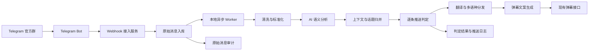

# Telegram 群情绪事件弹幕方案设计

> 2026-05-09 修订：当前 MVP 以 [Telegram 弹幕 MVP 设计方案](./2026-05-09-danmaku-mvp-design.md) 为准。弹幕生成链路不再做翻译和多语言镜像分发，话题只作为分享字段 `topic` 保留，不再维护独立话题表。

## 1. 背景

当前存在一个明确业务场景：

- 平台拥有自己的 Telegram 官方群
- 群内会持续讨论 BTC、ETH、SOL 等币对信息
- 交易页面已经具备现成的弹幕推送接口
- 目标不是做自动交易信号，而是给 K 线页面增加“情绪和事件感知”

本方案希望把官方群消息转化为：

- 可展示的站内弹幕内容
- 消息关联的交易对
- 消息所属的话题
- 对用户有价值但不过度打扰的口语化弹幕信息

当前规模假设：

- 约 15 个官方群
- 每个群对应 1 种语言
- 每个群高峰日约 2000 到 3000 条消息
- 全部官方群合计高峰日约 3 万到 4.5 万条消息

## 2. 目标与边界

### 2.1 业务目标

为 K 线页面提供基于 Telegram 官方群消息的准实时弹幕能力。系统抓取群内文本消息，过滤广告和无意义内容，识别关联交易对和上下文话题，再将值得展示的内容分发到对应交易页面。

### 2.2 产品定位

本系统是“市场情绪/事件辅助系统”，不是“投资建议系统”。

系统输出的是：

- 该条消息是否应该展示为弹幕
- 该条消息关联的交易对
- 该条消息所属的话题
- 面向目标页面语言的弹幕文案

系统不输出的是：

- 买入/卖出建议
- 自动交易信号
- 盈亏承诺
- 极端煽动性文案

### 2.3 本期范围

- 输入源：自有 Telegram 官方群
- 接入方式：Telegram Bot API
- 群语言：一个群对应一种语言
- 规模假设：约 15 个官方群，日高峰总量约 3 万到 4.5 万条
- 输出方式：调用现有弹幕接口
- 展示目标：K 线页面相关币对弹幕
- 优先支持：BTC / ETH / SOL / XRP 等主流币对
- 对没有独立 TG 社群的语言，翻译英文社群内容后分发

### 2.4 本期不做

- 前端弹幕展示改造
- 自动下单或交易联动
- 图片 OCR、语音转写、视频解析
- 跨语言混合群复杂识别
- 对外展示原始群消息全文
- 用户级深度个性化推荐
- 链接内容抓取、链接预览抓取或外部网页解析

## 3. 核心结论

### 3.1 方案可行

在“自有官方群 + Bot 合法接入 + 现成弹幕接口”的前提下，该方案技术上可行，工程复杂度中等，适合先做 MVP。

### 3.1.1 MVP 架构取舍

第一版不建议先引入 MQ，建议采用：

- Webhook 接入
- 原始消息落库
- 数据库状态机
- 本地异步 worker 扫描待处理消息

原因：

- 当前接入群数量和消息量可控
- 方案更简单，部署和评审成本更低
- 更适合先验证业务价值
- 后续仍可平滑升级到 MQ

### 3.2 推送策略结论

按最新产品要求，本期不再区分普通消息和高优先级消息，也不以聚合事件作为主要推送单位。

建议采用：

- 每条消息独立进入分析链路
- 先过滤广告、刷屏、无意义水聊、管理员消息、非文字消息、链接型消息
- 对剩余消息判断是否值得推送
- 值得推送的消息生成 1 条更像人说话的弹幕
- 识别关联交易对和话题后分发到目标交易页面
- 使用轻量去重和限频避免刷屏

一句话概括：

**每条文本消息都实时判断，但只有有价值、可归属交易对的话题内容才推送。**

### 3.3 推荐时效策略

- 候选消息：处理完成后立即进入推送判定
- 广告、纯水聊、无意义消息、管理员消息、非文字消息：直接丢弃
- 同一用户短时间重复内容：不推送
- 同一币对相似内容短时间重复：不推送或降采样
- 单币对限频可保留为保护阈值，例如 10 到 20 秒最多 1 条

### 3.3.1 无明确交易对内容的推荐策略

不建议默认发送到 BTC，也不建议发送到每个交易对。

推荐规则：

- 能通过语义明确关联到一个或多个交易对：只发对应交易对
- 属于某个已识别话题，且话题已有明确交易对：跟随该话题发送到同一交易页面
- 属于全市场或宏观类内容，但没有明确交易对：本期默认 `hold` 或不展示
- 如果后续有“大盘/资讯/全局弹幕”页面，再单独承接这类内容

原因：

- 默认发 BTC 会污染 BTC 页面
- 每个交易对都发会造成噪音和误导
- 无明确归属的内容很难证明对当前 K 线用户有价值

### 3.4 弹幕路由与文案约束

本方案默认：

- 每个币对页面独立接收自己的弹幕
- 弹幕推送按币对独立路由
- `symbol` 只作为内部路由字段存在
- 弹幕正文默认不再重复展示币对名

例如：

- 页面已经是 BTC K 线页
- 那么弹幕正文写：
  - `看多的人开始变多了`
- 不再写：
  - `BTC 群内看多情绪升温，讨论集中在突破前高`

## 4. 总体架构



### 4.1 模块划分

- Telegram Bot 接入层
- Webhook 接入服务
- 原始消息存储
- 本地异步 worker
- 消息清洗与标准化服务
- AI 语义分析服务
- 上下文与话题归并服务
- 逐条推送判定服务
- 翻译与多语种分发服务
- 弹幕推送服务
- 审计与回放模块

## 5. Telegram Bot 接入方案

## 5.1 接入前提

本方案适用于以下前提：

- 群是平台自有官方群
- 允许 Bot 入群
- 允许 Bot 获取群内消息
- 群消息以文本为主
- 每个群配置唯一语言

## 5.2 接入方式选择

正式环境建议使用 Telegram Bot API 的 Webhook 模式。

### 为什么选 Webhook

- 实时性更好
- 架构更清晰
- 不需要主动轮询
- 更适合生产环境长期运行

开发/测试环境可支持 Long Polling，但生产不建议以轮询为主。

## 5.3 Bot 接入准备

### 1. 创建 Bot

通过 BotFather 创建 Telegram Bot，获取 `BOT_TOKEN`。

### 2. 将 Bot 拉入官方群

Bot 被加入官方群后，才能接收该群消息。

### 3. 配置 Bot 权限

需要保证 Bot 可以读取群消息。

### 4. 关闭 Privacy Mode

这是关键步骤。

如果 Privacy Mode 打开，Bot 往往只能收到：

- 发给它的命令
- 提及它的消息
- 回复它的消息

为了获取官方群正常讨论内容，需要在 BotFather 中关闭 privacy mode。

## 5.4 Webhook 设计

建议提供独立接入接口：

`POST /telegram/webhook/{secret}`

### Webhook 职责

- 校验 secret path
- 解析 Telegram update
- 过滤非目标群消息
- 过滤无效消息
- 原始消息入库
- 标记处理状态为 `pending`
- 快速返回 200

### 为什么必须轻处理

Webhook 内不适合直接执行 AI 分析，因为：

- 容易超时
- Telegram 可能重试
- 容易造成重复入库或重复推送

因此接入层只做轻处理，AI 分析交给本地异步 worker。

## 5.5 需要解析的 Telegram 字段

按产品需求，建议抓取以下字段：

- `update_id`
- `message.message_id`
- `message.date`
- `message.text`
- `message.entities`
- `message.from.id`
- `message.from.first_name`
- `message.from.last_name`
- `message.from.username`
- `message.reply_to_message`
- `message.forward_date`
- `message.forward_from`
- `message.forward_from_chat`
- `message.chat.id`
- `message.chat.title`
- `message.chat.type`

字段说明：

- `message_id`：群内消息唯一编号
- `date`：发送时间，Unix 时间戳
- `text`：纯文字消息内容
- `entities`：链接、@ 用户名、话题标签、粗体、代码块等文本实体
- `from.id`：用户数字 ID
- `reply_to_message`：回复消息，可保存被回复消息的必要文本和元信息
- `forward_date / forward_from`：转发来源和原始发布时间
- `first_name / last_name / username`：用户公开资料

不抓取或不处理：

- 图片、视频、语音、文件等非文字信息
- 链接内容、链接预览和外部网页正文
- 管理员发送的信息

说明：

- 如果文本消息中带 URL，可记录 `entities` 用于广告识别，但不展开链接内容
- 纯链接或强链接导流消息默认过滤，不进入弹幕展示
- 管理员识别建议通过 Telegram Bot API 获取群管理员列表并本地缓存

## 5.6 幂等与去重

Telegram Webhook 可能因网络或超时触发重复投递。

因此接入层必须做幂等：

- 使用 `update_id` 去重
- 使用 `group_id + message_id` 做二级幂等

## 5.7 群配置设计

建议维护一张群配置表 `tg_group_config`。

字段建议：

- `group_id`
- `group_name`
- `language`
- `source_language`
- `mirror_from_group_id`
- `enabled`
- `sort_weight`
- `trust_level`
- `allowed_symbols_json`
- `push_enabled`
- `created_at`
- `updated_at`

用途：

- 标记语言
- 控制是否启用
- 控制群权重
- 限制该群重点覆盖的币种

## 6. 核心处理流程

## 6.1 实时处理链路

1. Telegram 官方群产生新消息
2. Bot 通过 Webhook 将消息推送到接入服务
3. 接入服务进行轻过滤和原始入库
4. 将消息状态标记为 `pending`
5. 本地异步 worker 扫描并抢占 `pending` 任务
6. 清洗层做标准化处理
7. AI 服务判断广告、关联交易对、可展示性和语义摘要
8. 上下文服务寻找与当前消息相关的历史 TG 消息和站内弹幕，组成内容集合
9. 话题服务为内容集合提炼关键字，生成 `topic_key`
10. 推送判定层判断该消息是否值得推送
11. 分发层根据交易对、话题和目标语言生成投递目标
12. 生成对应语言的口语化弹幕文案
13. 调用现有弹幕接口推送
14. 更新状态为 `done / failed / discarded`

## 6.1.1 本地异步 worker 设计

MVP 阶段推荐采用“数据库状态机 + 本地异步 worker”，而不是先引入 MQ。

### 推荐模式

- Webhook 收到消息后只负责写库
- 原始消息表记录处理状态
- 后台 worker 周期扫描 `pending`
- 抢占任务后执行分析、判定和推送
- 失败任务进入重试机制

### 为什么不用纯内存异步

如果只是在 Webhook 内直接做内存异步提交，会有这些问题：

- 进程重启时未完成任务可能丢失
- 无法可靠重试
- 无法追踪处理进度
- 排障难度高

因此第一版更稳妥的方式是数据库驱动的本地 worker。

### 建议状态机

- `pending`
- `processing`
- `done`
- `failed`
- `discarded`

### 建议补充字段

- `retry_count`
- `next_retry_at`
- `last_error`
- `processing_started_at`

### 建议处理机制

- worker 每 1 到 3 秒扫描一次待处理消息
- 使用抢占更新或数据库锁避免重复处理
- 超时未完成的 `processing` 任务可回收
- 达到最大重试次数后转为 `failed`

## 6.2 逐条消息推送判定策略

本期不做高优先级，也不要求先聚合成事件。

每条消息进入处理后，输出三类结果：

- `push`：消息有明确币对，内容对看盘用户有价值，可以生成弹幕
- `discard`：广告、无意义水聊、表情、刷屏、无币对内容，不推送
- `hold`：内容可能有价值但交易对或话题归属不足，先不推送，仅记录用于后续观察

示例：

- 原始消息：`突破前高了？这波感觉有人在抢`
- 判定：`push`
- 弹幕：`都在盯能不能突破前高`

## 6.3 限流与去重

限流与去重只作为保护规则，不再承担聚合生成职责。

建议规则：

- 单币对每 10 到 20 秒最多 1 条弹幕
- 同一用户短时间重复内容不推送
- 高度相似文本 60 秒内只推 1 条
- 广告链接、合约地址刷屏、拉群导流直接丢弃
- 无明确币对且无法路由的消息直接丢弃

## 7. AI 结构化理解设计

## 7.1 AI 负责什么

大模型只负责理解，不直接负责推送决策。

负责：

- 币对识别
- 情绪判断
- 事件分类
- 可信度判断
- 一句话客观摘要
- 是否可展示初判

不负责：

- 推送频率控制
- 去重逻辑
- 限流策略
- 最终路由策略
- 投资建议输出

## 7.2 结构化输出字段

每条消息建议输出：

- `symbols`
- `sentiment`
- `event_type`
- `confidence`
- `importance`
- `rumor_level`
- `displayable`
- `summary`

## 7.3 建议的分类枚举

### 情绪

- `bullish`
- `bearish`
- `mixed`
- `neutral`

### 事件类型

- `market_discussion`
- `announcement`
- `rumor`
- `exchange`
- `macro`
- `onchain`
- `large_transfer`
- `risk_alert`

### 可信度

使用 0 到 100 分值。

### 传闻等级

- `low`
- `medium`
- `high`

## 7.4 AI 输出示例

```json
{
  "symbols": ["BTC"],
  "primary_symbol": "BTC",
  "sentiment": "bullish",
  "event_type": "market_discussion",
  "is_ad": false,
  "ad_reason": null,
  "confidence": 82,
  "importance": 73,
  "rumor_level": "low",
  "displayable": true,
  "summary": "群内对突破前高的讨论明显升温",
  "topic_key": "BTC_breakout_previous_high",
  "topic_keywords": ["breakout", "previous high"],
  "decision_suggestion": "push",
  "style_hint": "emotion"
}
```

## 7.5 Prompt 约束原则

- 必须输出 JSON
- 只能使用约定的枚举值
- 不能输出投资建议
- 对不确定内容要降低置信度
- 对纯水聊、玩笑、无币对内容允许 `displayable=false`

## 8. 逐条推送判定设计

## 8.1 为什么判定层最关键

系统成败不在“采集到了多少消息”，而在“最终推了什么”。

如果没有判定层，结果通常会是：

- 噪音过高
- 弹幕刷屏
- 广告、无意义消息混入 K 线页
- 用户觉得干扰大于价值

## 8.2 推送判定输入

每条消息的判定建议依赖：

- `raw_text`
- `language`
- `symbols`
- `topic_key`
- `context_message_ids`
- `event_type`
- `sentiment`
- `confidence`
- `displayable`
- `is_ad`
- `summary`
- sender 短时行为特征
- 文本重复度和广告特征

## 8.3 过滤规则

优先通过规则过滤明显无效内容：

- 广告、邀请链接、返佣、带单、群导流
- 纯表情、无意义字符、重复刷屏
- 没有明确币对且无法路由的消息
- 与行情、事件、风险、情绪无关的闲聊
- 明显机器人格式消息
- 管理员消息
- 非文字消息
- 纯链接消息

AI 主要负责处理规则无法稳定判断的部分：

- 是否广告或导流
- 是否和某个币对相关
- 是否能归入已有话题
- 是否能转成对看盘用户有价值的弹幕
- 情绪、事件和可信度判断
- 一句话摘要和口吻提示

## 8.4 推送判定建议

一条消息是否推送，建议至少满足：

- 有明确币对
- `displayable = true`
- `is_ad = false`
- `confidence >= 50`
- 未命中去重
- 未超过币对限频
- 内容不是广告、刷屏、无意义水聊
- 能改写成 1 条自然弹幕

不再设置 `high_priority`。即使是公告、传闻或风险提醒，也走同一套“是否应该推送”的判断，只是 `event_type` 不同。

## 8.5 上下文与话题设计

上下文的目标不是把所有聊天合并成事件，而是判断当前消息是否属于某个可展示话题。

上下文来源：

- 当前消息的 `reply_to_message`
- 同群同交易对近 5 到 10 分钟消息
- 文本相似或语义相似的历史消息
- 站内近期已展示弹幕

内容集合建议包含：

- 当前消息
- 相关 TG 消息 ID 列表
- 相关站内弹幕 ID 列表
- 关联交易对
- 话题关键字
- 话题摘要

话题提炼输出：

- `topic_key`：稳定话题标识，例如 `BTC_breakout_previous_high`
- `topic_keywords`：给产品和运营查看的关键词
- `topic_summary`：面向审计和调试的短摘要
- `topic_symbols`：该话题明确关联的交易对

分发规则：

- 当前消息有明确交易对：发到对应交易页面
- 当前消息没有明确交易对，但归入已有话题：发到该话题关联的交易页面
- 当前消息和话题都没有明确交易对：默认不发，记录为 `hold`

## 8.6 多语种分发设计

产品指定以下语言没有自己的 TG 社群，需要展示英文社群内容：

- 德语：`de`
- 印地语：`hi`
- 波斯语：`fa`
- 罗马尼亚语：`ro`
- 荷兰语：`nl`
- 波兰语：`pl`

规则：

- 英文社群内容先完成语义分析、话题归属和交易对分发
- 只有判定为 `push` 的英文内容才进入翻译
- 翻译发生在推送前，生成目标语言弹幕正文
- 这不是前端页面 AI 翻译，而是后端提前生成并投递目标语言内容
- 目标语言页面收到的就是对应语言的 `content`

## 9. 文案生成规则

## 9.1 文案原则

- 像真实用户随手发出的短弹幕
- 短，一般 8 到 22 个中文字符
- 口语化，但不低俗、不煽动
- 能传达情绪、事件或提醒
- 不像喊单，也不像系统公告
- 默认不在正文中重复带币对名

说明：

- 币对信息由内部 `symbol` 字段承担路由职责
- 正文默认只保留情绪、事件和可信度表达
- 只有未来出现“多币对混流弹幕”场景时，再考虑恢复币对名前缀或增加标签
- 文案是对群体讨论的二次转述，不伪装成某个真实用户原话
- 最终弹幕文案应与 AI 结构化摘要解耦，结构化摘要负责准确，弹幕文案负责像人说话

## 9.2 推荐口吻

建议第一版使用以下几类口吻混排，避免所有弹幕都像同一个模板生成。

### 观察型

- `这波讨论突然热起来了`
- `大家开始盯关键位置了`
- `这会儿群里消息明显多了`

### 情绪型

- `看多的人开始变多了`
- `短线情绪有点转弱`
- `多空又吵起来了`

### 提醒型

- `这个消息先别急着信`
- `传闻还没锤，先观望`
- `波动可能要放大了`

### 事件型

- `有人在聊上所传闻`
- `风险提醒开始被刷到了`
- `公告消息刚被转起来`

## 9.3 推荐模板

### 偏多

- `看多的人开始变多了`
- `都在盯能不能突破前高`
- `这波讨论有点偏多了`

### 偏空

- `担心回落的人变多了`
- `短线情绪有点转弱`
- `这会儿偏空声音多了些`

### 分歧

- `多空又吵起来了`
- `大家看法分得挺开`
- `热度上来了，但方向没吵明白`

### 传闻

- `这个消息先别急着信`
- `传闻还没锤，先观望`
- `消息在传，真假还得等等`

## 9.4 文案生成策略

第一版建议采用“逐条结构化理解 + 模板化口语改写”的两段式策略：

- AI 先输出结构化结果：`sentiment`、`event_type`、`confidence`、`importance`、`rumor_level`、`summary`
- 判定层只决定该消息是否值得推送，不直接拼接最终文案
- 文案层根据单条消息的结构化结果选择 1 条口语化模板，并填入少量事件短语
- 同一 `symbol + event_type + sentiment` 在短时间内避免重复使用同一模板
- 每类事件准备 5 到 10 条模板，线上根据点击、停留或用户反馈迭代

如果使用模型直接生成最终文案，建议一次生成 3 条候选，再由规则选择：

- 过滤超过长度限制的候选
- 过滤包含喊单、绝对判断、收益承诺的候选
- 过滤像系统公告的候选，例如连续出现“群内”“情绪”“讨论热度”
- 优先选择口语自然、信息明确、不过度刺激的候选

## 9.5 禁止项

- 必涨、必跌、快买、快跑
- 明确收益承诺
- 绝对化判断
- 高煽动性用词
- 伪造用户原话或具体身份，例如“某大户说”“群主确定了”
- 过度官方化表达，例如“市场情绪显著升温，请投资者注意风险”

## 9.6 推荐产品验收标准

- 连续 20 条弹幕读起来不应像同一个模板
- 不应频繁出现“群内”“讨论”“情绪”等系统播报词
- 用户能在 1 秒内看懂大概发生了什么
- 不构成买卖建议，不制造确定性结论
- 同一事件重复出现时，文案有轻微变化但含义一致

## 10. 数据表设计

## 10.1 原始消息表 `tg_raw_message`

字段建议：

- `id`
- `update_id`
- `group_id`
- `group_name`
- `language`
- `message_id`
- `sender_id`
- `sender_name`
- `sender_first_name`
- `sender_last_name`
- `sender_username`
- `sender_is_admin`
- `sent_at`
- `text`
- `normalized_text`
- `entities_json`
- `reply_to_message_id`
- `reply_to_text`
- `forward_date`
- `forward_from_id`
- `forward_from_username`
- `forward_from_chat_id`
- `has_link`
- `has_media`
- `ingest_status`
- `retry_count`
- `next_retry_at`
- `last_error`
- `processing_started_at`
- `created_at`

用途：

- 审计
- 回放
- 排障
- 重跑 AI 分析

## 10.2 消息分析表 `tg_message_analysis`

字段建议：

- `id`
- `raw_message_id`
- `symbols_json`
- `primary_symbol`
- `sentiment`
- `event_type`
- `is_ad`
- `ad_reason`
- `confidence`
- `importance`
- `rumor_level`
- `displayable`
- `summary`
- `context_message_ids_json`
- `related_danmaku_ids_json`
- `topic_key`
- `topic_keywords_json`
- `topic_summary`
- `decision_suggestion`
- `decision_reason`
- `style_hint`
- `model_name`
- `prompt_version`
- `created_at`

## 10.3 推送判定日志表 `tg_push_decision_log`

用途：

- 记录每条消息为什么推送或不推送
- 支持产品验收、排障和规则迭代

字段建议：

- `id`
- `raw_message_id`
- `analysis_id`
- `language`
- `symbol`
- `event_type`
- `sentiment`
- `topic_key`
- `decision`
- `decision_reason`
- `dedupe_key`
- `rate_limited`
- `final_content`
- `created_at`

## 10.4 话题集合表 `tg_topic_context`

用途：

- 记录同一语义话题下的 TG 消息和站内弹幕
- 支持将无明确交易对但归属同话题的内容发送到同一交易页面

字段建议：

- `id`
- `topic_key`
- `language`
- `symbols_json`
- `keywords_json`
- `summary`
- `tg_message_ids_json`
- `danmaku_ids_json`
- `last_message_at`
- `created_at`
- `updated_at`

## 10.5 推送日志表 `danmaku_push_log`

字段建议：

- `id`
- `raw_message_id`
- `decision_id`
- `symbol`
- `language`
- `target_language`
- `topic_key`
- `push_content`
- `push_status`
- `response_body`
- `pushed_at`

## 11. 接口设计

## 11.1 Webhook 接口

`POST /telegram/webhook/{secret}`

职责：

- 接收 Telegram update
- 校验 secret
- 提取有效消息
- 原始入库
- 标记处理状态

## 11.1.1 后台 worker 拉取逻辑

worker 处理逻辑建议如下：

1. 扫描满足条件的消息：
   - `ingest_status = pending`
   - `next_retry_at <= now`
2. 抢占为 `processing`
3. 处理完成后更新为 `done`
4. 失败时增加 `retry_count`
5. 超过阈值后转为 `failed`

## 11.2 内部结构化事件消息

```json
{
  "raw_message_id": 123456,
  "group_id": -100123456789,
  "language": "zh",
  "message_id": 7890,
  "text": "Looks strong, breakout soon",
  "entities": [],
  "sender_id": 998877,
  "sender_username": "example_user",
  "reply_to_message_id": null,
  "forward_date": null,
  "sent_at": 1770000000
}
```

## 11.3 弹幕接口投递结构

说明：

- `symbol` 用于内部路由到对应币对页面
- `content` 默认不重复携带币对名

```json
{
  "symbol": "BTC",
  "source_language": "en",
  "target_language": "zh",
  "content": "看多的人开始变多了",
  "event_type": "market_discussion",
  "sentiment": "bullish",
  "confidence": 83,
  "topic_key": "BTC_breakout_previous_high",
  "topic_keywords": ["breakout", "previous high"],
  "raw_message_id": 123456,
  "content_style": "human_rewrite",
  "template_id": "bullish_003",
  "display_duration": 6000,
  "source": "telegram_sentiment_engine",
  "timestamp": 1770000000
}
```

## 12. 可能遇到的坑

## 12.1 接入层的坑

### 1. Privacy Mode 没关闭

现象：

- Bot 只能收到命令消息
- 正常群聊拿不到

解决：

- 在 BotFather 中关闭 privacy mode

### 2. Bot 权限不足

现象：

- 某些群完全没消息
- 部分消息不可见

解决：

- 检查 Bot 是否已入群
- 检查群权限配置
- 用测试消息做联调验证

### 3. Webhook 重复投递

风险：

- 重复入库
- 重复推送弹幕

解决：

- 使用 `update_id` 去重
- 使用 `group_id + message_id` 幂等

### 4. Webhook 阻塞

风险：

- Telegram 重试
- 接入雪崩

解决：

- 接入层轻处理
- 快速 ACK
- AI 分析异步化

### 5. 本地异步任务丢失

风险：

- 进程重启时未完成任务丢失

解决：

- 不使用纯内存 fire-and-forget
- 使用数据库状态机记录任务
- 通过 `pending / processing / failed` 做恢复处理

## 12.2 语义理解的坑

### 6. 币种简称歧义

风险：

- 错把无关词识别成币种

解决：

- 维护币种词典
- 结合上下文校验
- 低置信时不推

### 7. 情绪判断不稳定

风险：

- 讽刺、反话、群内黑话误判

解决：

- 使用群语料迭代 prompt
- 建立保守输出机制
- 低置信内容降级

### 8. 事件类型误判

风险：

- 传闻、公告、KOL 观点被混淆

解决：

- 第一版采用粗分类
- 保留 rumor_level
- 弱提示未证实内容

## 12.3 推送判定层的坑

### 9. 刷屏

风险：

- 同一事件被大量复读
- 用户体验差

解决：

- 相似消息合并
- 单币对限频
- 同一用户重复内容直接丢弃

### 10. 大群天然放大热度

风险：

- 人多不代表信息更有价值

解决：

- 引入群权重
- 对热度做归一化
- 限制单群热度上限

### 11. 弹幕过吵

风险：

- 影响用户看盘

解决：

- 高频消息只保留摘要
- 低价值内容不推
- 控制每个币对弹幕密度

## 12.4 合规与内容风险

### 12. 文案过于像投资建议

解决：

- 统一文案模板
- 保持客观语气
- 禁止极端交易措辞

### 13. 传闻误导

解决：

- 单独分类 rumor
- 标记“待确认”
- 低可信度内容弱提示或不推

### 14. 内容授权问题

当前前提是自有官方群，风险较小，但仍建议：

- 不直接展示原文
- 对外展示摘要而非全文
- 保留审计链路

## 12.5 工程实现的坑

### 15. LLM 成本

风险：

- 群消息量上来后成本快速上升

解决：

- 先做规则预过滤
- 只对候选消息调用 AI
- 从少量官方群开始

### 16. 实时性和准确性冲突

风险：

- 等太久不够实时
- 推太快噪音过高

解决：

- 每条消息处理完成后立即判定
- 用规则过滤和限频控制噪音

### 17. 多群同事件重复

风险：

- 多个官方群同时讨论同一事件

解决：

- 第一版先用相似文本去重 + 币对限频
- 后续如确实刷屏，再增加跨群事件归并

## 13. MVP 范围建议

## 13.1 第一版支持

- 3 个 Telegram 官方群
- 每个群单语言
- 5 个主流币对
- 文本消息接入
- 数据库驱动的本地异步 worker
- 币对识别
- 情绪分类
- 事件分类
- 逐条消息推送判定
- 广告、刷屏、无意义消息过滤
- 相似内容去重和单币对限频
- 口语化弹幕文案生成
- 接现有弹幕接口

## 13.2 第一版不做

- 非文本消息
- 全币种覆盖
- 自动交易建议
- 深度个性化推荐
- 复杂跨语言融合
- OCR 和语音识别

## 14. 排期建议

## 第 1 阶段：接入验证，3 到 5 天

- Bot 创建与权限配置
- 关闭 privacy mode
- Webhook 接入服务
- 原始消息入库
- 本地异步 worker 框架
- 群配置表落地

## 第 2 阶段：结构化理解，5 到 7 天

- 消息清洗
- 币种词典
- AI JSON 输出
- 情绪与事件分类

## 第 3 阶段：判定推送，5 到 7 天

- 推送判定服务
- 广告和无意义消息过滤
- 去重和限流
- 文案模板
- 接现有弹幕接口

## 第 4 阶段：调优与验证，5 天

- 误报分析
- 推送判定规则调优
- 弹幕口吻样本调优
- 审计与回放增强

## 15. AI 模型与成本测算

## 15.1 当前前提

当前公司使用 Google Gemini 模型。

本方案建议优先考虑：

- `gemini-2.5-flash-lite`
  - 作为第一层结构化提取模型
  - 优势是成本低、吞吐高
- `gemini-2.5-flash`
  - 作为高价值或复杂消息的升级模型
  - 优势是理解更强，适合复杂语义或复核

## 15.2 官方定价基线

按 Google Gemini Developer API 官方定价（2026-05-06 查询）：

- Gemini 2.5 Flash
  - 输入：$0.30 / 1M tokens
  - 输出：$2.50 / 1M tokens
- Gemini 2.5 Flash-Lite
  - 输入：$0.10 / 1M tokens
  - 输出：$0.40 / 1M tokens

说明：

- 以上为标准文本调用价格
- 本方案暂不包含 grounding、缓存、音频、图像等额外费用

## 15.3 消息规模假设

- 群数量：15 个
- 每群高峰日消息量：2000 到 3000 条
- 总高峰日消息量：3 万到 4.5 万条

## 15.4 Token 测算假设

为便于评审，采用保守估算。

### 方案 A：每条消息都调用模型

假设：

- 平均输入 token：700 / 条
  - 含消息文本、结构化 prompt、规则说明
- 平均输出 token：120 / 条
  - 含 JSON 结构化结果

### 方案 B：推荐方案，先预过滤后再进模型

假设：

- 只有 25% 的候选消息进入模型
- 平均输入 token：650 / 条
- 平均输出 token：100 / 条

这是更推荐的实际落地方案，因为官方群消息里会有不少闲聊、水聊和无币种消息，完全没有必要全部送进模型。

## 15.5 成本测算

### 方案 A：每条消息都进模型

#### 日消息量 3 万条

- 输入 token：30000 × 700 = 21,000,000
- 输出 token：30000 × 120 = 3,600,000

Gemini 2.5 Flash：

- 输入成本：21 × $0.30 = $6.30 / 天
- 输出成本：3.6 × $2.50 = $9.00 / 天
- 合计：$15.30 / 天
- 月成本约：$459 / 月

Gemini 2.5 Flash-Lite：

- 输入成本：21 × $0.10 = $2.10 / 天
- 输出成本：3.6 × $0.40 = $1.44 / 天
- 合计：$3.54 / 天
- 月成本约：$106.20 / 月

#### 日消息量 4.5 万条

- 输入 token：45000 × 700 = 31,500,000
- 输出 token：45000 × 120 = 5,400,000

Gemini 2.5 Flash：

- 输入成本：31.5 × $0.30 = $9.45 / 天
- 输出成本：5.4 × $2.50 = $13.50 / 天
- 合计：$22.95 / 天
- 月成本约：$688.50 / 月

Gemini 2.5 Flash-Lite：

- 输入成本：31.5 × $0.10 = $3.15 / 天
- 输出成本：5.4 × $0.40 = $2.16 / 天
- 合计：$5.31 / 天
- 月成本约：$159.30 / 月

### 方案 B：推荐方案，25% 候选消息进模型

#### 日消息量 3 万条

- 候选消息数：7500 条
- 输入 token：7,500 × 650 = 4,875,000
- 输出 token：7,500 × 100 = 750,000

Gemini 2.5 Flash：

- 输入成本：4.875 × $0.30 = $1.46 / 天
- 输出成本：0.75 × $2.50 = $1.88 / 天
- 合计：约 $3.34 / 天
- 月成本约：$100.20 / 月

Gemini 2.5 Flash-Lite：

- 输入成本：4.875 × $0.10 = $0.49 / 天
- 输出成本：0.75 × $0.40 = $0.30 / 天
- 合计：约 $0.79 / 天
- 月成本约：$23.70 / 月

#### 日消息量 4.5 万条

- 候选消息数：11250 条
- 输入 token：11,250 × 650 = 7,312,500
- 输出 token：11,250 × 100 = 1,125,000

Gemini 2.5 Flash：

- 输入成本：7.3125 × $0.30 = $2.19 / 天
- 输出成本：1.125 × $2.50 = $2.81 / 天
- 合计：约 $5.01 / 天
- 月成本约：$150.30 / 月

Gemini 2.5 Flash-Lite：

- 输入成本：7.3125 × $0.10 = $0.73 / 天
- 输出成本：1.125 × $0.40 = $0.45 / 天
- 合计：约 $1.18 / 天
- 月成本约：$35.40 / 月

## 15.6 成本结论

如果每条消息都调用模型，成本虽然仍然可控，但没有必要。

更推荐的路线是：

- 先做规则预过滤
- 让只有 20% 到 30% 的候选消息进入 Gemini
- 第一层使用 `gemini-2.5-flash-lite`
- 对高价值、复杂、模糊消息再升级到 `gemini-2.5-flash`

这样可以兼顾：

- 成本可控
- 多语言支持
- 延迟可控
- 理解准确率

## 15.7 推荐模型策略

### 第一层：主流程模型

推荐：

- `gemini-2.5-flash-lite`

职责：

- 币对识别
- 情绪判断
- 事件分类
- 是否可展示
- 简短结构化摘要

### 第二层：升级模型

推荐：

- `gemini-2.5-flash`

触发条件示例：

- 低置信但高热度
- 高价值公告类消息
- 文本表达复杂
- 多币种冲突
- 需要更高准确率的复核

## 16. 评审建议强调的决策点

### 1. 为什么先做官方群

- 权限和合规最清晰
- Bot 接入简单稳定
- 可控性高

### 2. 为什么用 Bot Webhook

- 标准方案
- 实时性更好
- 生产可运维

### 3. 为什么 MVP 不先上 MQ

- 当前规模可控
- 本地异步 worker 足够支撑
- 方案更简单，更快落地
- 后续仍可平滑升级

### 4. 为什么不是每条消息都推送

- 每条都推噪音太大
- 容易刷屏
- 广告和无意义消息会伤害体验
- 产品目标是逐条判断是否值得推送，而不是逐条必推

### 5. 为什么 AI 只做理解，不做最终决策

- 可控
- 成本可管理
- 便于审计和迭代

### 6. 为什么先做情绪/事件感知，而不是交易建议

- 风险更低
- 更适合快速上线验证
- 用户价值明确

## 17. 结论

该需求适合落地为：

**“基于 Telegram 官方群消息的 K 线情绪与事件弹幕系统”**

第一版核心不在“覆盖所有信息”，而在“把真正有价值的信息稳定、克制、准实时地推出来”。

最终建议路线是：

- 自有官方群
- Telegram Bot Webhook 接入
- 原始消息全量审计
- 数据库驱动的本地异步 worker
- AI 做结构化理解
- 逐条消息推送判定
- 广告、刷屏和无意义消息过滤
- 口语化弹幕文案生成
- 对接现有弹幕接口

这是一个可在短周期内做出 MVP、并且具有明确业务验证价值的方案。
