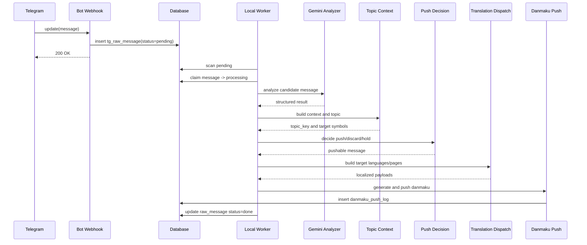
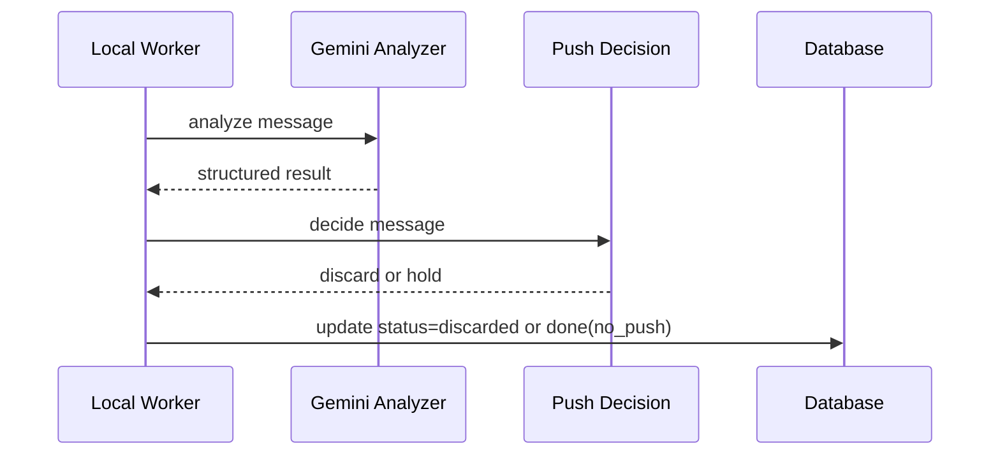
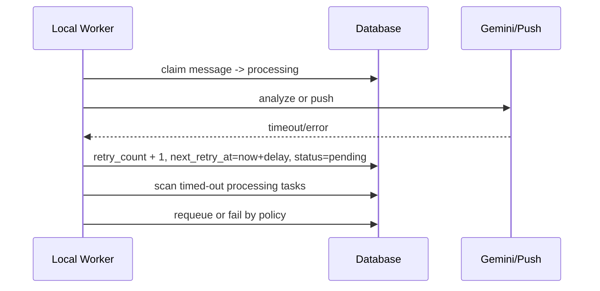
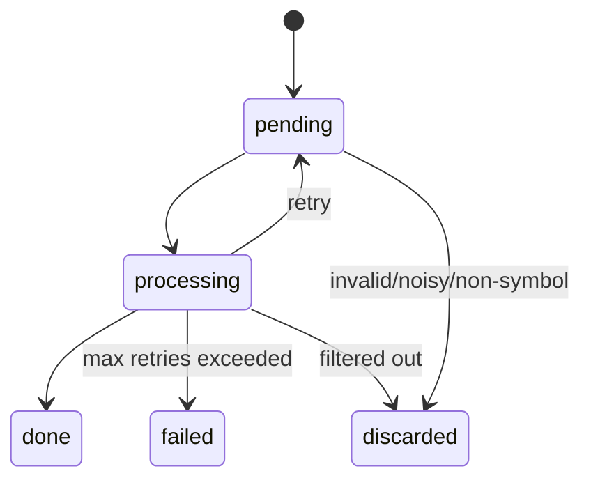

# Telegram 群情绪事件弹幕技术方案

> 2026-05-09 修订：当前 MVP 以 [Telegram 弹幕 MVP 设计方案](./2026-05-09-danmaku-mvp-design.md) 和当前代码实现为准。弹幕生成链路不再做翻译和多语言镜像分发，话题只作为分享字段 `topic` 保留，不再维护独立话题表。

## 1. 文档目的

本文档是 [2026-05-06-telegram-sentiment-danmaku-design.md](/Users/fengpengju/Documents/fetchnow/docs/plans/2026-05-06-telegram-sentiment-danmaku-design.md) 的技术落地版。

目标是从工程角度明确：

- 系统如何拆分
- 数据如何流转
- 本地异步 worker 如何实现
- AI 调用如何控制
- 逐条推送判定、上下文话题、翻译分发和弹幕生成如何落地
- 如何保证幂等、重试、排障和后续扩展

本文档默认前提：

- 接入的是自有 Telegram 官方群
- 使用 Telegram Bot API
- 每个群对应一种语言
- 前端已有现成弹幕接口
- 每个币对页面独立接收该币对弹幕
- `symbol` 只作为内部路由字段，弹幕正文默认不重复带币对名
- 不抓取非文字内容、链接内容和管理员消息
- 德语、印地语、波斯语、罗马尼亚语、荷兰语、波兰语页面复用英文社群内容，经后端翻译后投递

## 2. 技术目标

系统需要满足以下目标：

- 能稳定接入 Telegram 官方群消息
- Webhook 必须快速返回，不在请求线程中执行 AI
- 支持每天 3 万到 4.5 万条消息的处理规模
- 具备准实时能力，候选消息处理完成后尽快判定是否推送
- 不区分高优先级，所有消息走同一套推送判定逻辑
- 能识别广告、关联交易对、上下文内容集合和话题关键字
- 能按交易对、话题和目标语言分发弹幕
- 具备幂等、重试、审计和回放能力
- MVP 不引入 MQ，采用数据库驱动的本地异步 worker
- 后续可以平滑升级到 MQ 或拆分独立服务

## 3. 总体组件设计

## 3.1 组件划分

建议拆为以下逻辑模块：

1. `telegram-webhook-controller`
2. `telegram-ingest-service`
3. `telegram-message-worker`
4. `telegram-message-analyzer`
5. `telegram-topic-context-service`
6. `telegram-push-decision-service`
7. `telegram-translation-dispatch-service`
8. `danmaku-push-service`
9. `telegram-admin-query-service`

MVP 阶段可以都在一个服务内部实现，按模块拆分，不强制物理拆服务。

## 3.2 模块职责

### 3.2.1 `telegram-webhook-controller`

职责：

- 接收 Telegram Webhook 请求
- 校验请求路径与安全参数
- 解析 Telegram update
- 调用 ingest service
- 快速返回 200

要求：

- 不做 AI 调用
- 不做推送判定
- 不做远程推送调用

### 3.2.2 `telegram-ingest-service`

职责：

- 过滤非文字消息、管理员消息和无效消息
- 做基础标准化
- 原始消息入库
- 保存产品要求的消息、用户、reply、forward 和 entities 字段
- 初始化状态为 `pending`
- 处理幂等冲突

### 3.2.3 `telegram-message-worker`

职责：

- 周期扫描 `pending` 消息
- 抢占处理任务
- 驱动清洗、分析、判定、推送流程
- 处理重试与超时回收

### 3.2.4 `telegram-message-analyzer`

职责：

- 规则预过滤
- 关键词与币种识别
- 调用 Gemini 模型做结构化分析
- 判断是否广告
- 输出关联交易对、摘要、话题候选和可展示性
- 输出标准化分析结果

### 3.2.5 `telegram-topic-context-service`

职责：

- 根据 reply、近邻消息、语义相似消息和站内弹幕寻找上下文
- 将相关内容组成内容集合
- 提炼 `topic_key` 和 `topic_keywords`
- 维护话题与交易对的关系

### 3.2.6 `telegram-push-decision-service`

职责：

- 基于单条消息分析结果判断是否推送
- 过滤广告、刷屏、无意义消息、无币对消息
- 做相似文本去重和单币对限频保护
- 输出 `push / discard / hold` 判定结果

### 3.2.7 `telegram-translation-dispatch-service`

职责：

- 根据关联交易对和话题生成目标页面列表
- 对缺少独立 TG 社群的语言使用英文社群内容翻译投递
- 为每个目标语言生成待推送内容
- 无明确交易对且无法归入话题的内容标记为 `hold`

### 3.2.8 `danmaku-push-service`

职责：

- 根据 `symbol` 路由到对应币对页面
- 基于单条消息的结构化结果生成口语化最终弹幕
- 对候选弹幕做长度、风控和重复度过滤
- 调用现有弹幕接口
- 记录推送日志

### 3.2.9 `telegram-admin-query-service`

职责：

- 提供消息和推送查询能力
- 支持审计、排障和回放
- 不参与主链路

## 4. 总体时序

## 4.1 单条消息准实时链路



## 4.2 丢弃与暂不推送链路



## 4.3 重试与超时回收链路



## 5. 数据库设计

## 5.1 `tg_group_config`

用途：

- 管理官方群配置
- 绑定语言
- 控制启停与群权重

建议字段：

- `id`
- `group_id` bigint unique
- `group_name` varchar
- `language` varchar(16)
- `source_language` varchar(16) nullable
- `mirror_from_group_id` bigint nullable
- `enabled` boolean
- `sort_weight` int
- `trust_level` int
- `allowed_symbols_json` json
- `push_enabled` boolean
- `created_at`
- `updated_at`

建议索引：

- unique(`group_id`)
- index(`enabled`)

## 5.2 `tg_raw_message`

用途：

- 存储原始消息
- 承载状态机
- 支持审计、重试、回放

建议字段：

- `id` bigint pk
- `update_id` bigint
- `group_id` bigint
- `group_name` varchar
- `language` varchar(16)
- `message_id` bigint
- `sender_id` bigint
- `sender_name` varchar
- `sender_first_name` varchar nullable
- `sender_last_name` varchar nullable
- `sender_username` varchar nullable
- `sender_is_admin` boolean
- `sent_at` timestamp
- `text` text
- `normalized_text` text
- `entities_json` json nullable
- `reply_to_message_id` bigint nullable
- `reply_to_text` text nullable
- `forward_date` timestamp nullable
- `forward_from_id` bigint nullable
- `forward_from_username` varchar nullable
- `forward_from_chat_id` bigint nullable
- `has_link` boolean
- `has_media` boolean
- `ingest_status` varchar(32)
- `retry_count` int default 0
- `next_retry_at` timestamp nullable
- `last_error` text nullable
- `processing_started_at` timestamp nullable
- `created_at` timestamp
- `updated_at` timestamp

建议唯一约束：

- unique(`group_id`, `message_id`)
- unique(`update_id`)

建议索引：

- index(`ingest_status`, `next_retry_at`)
- index(`group_id`, `sent_at`)
- index(`language`, `sent_at`)

## 5.3 `tg_message_analysis`

用途：

- 存储 AI 结构化结果
- 支持后续纠偏和模型复跑

建议字段：

- `id`
- `raw_message_id` bigint unique
- `symbols_json` json
- `primary_symbol` varchar(32) nullable
- `sentiment` varchar(32)
- `event_type` varchar(32)
- `is_ad` boolean
- `ad_reason` varchar(128) nullable
- `confidence` int
- `importance` int
- `rumor_level` varchar(16)
- `displayable` boolean
- `summary` varchar(255)
- `context_message_ids_json` json nullable
- `related_danmaku_ids_json` json nullable
- `topic_key` varchar(128) nullable
- `topic_keywords_json` json nullable
- `topic_summary` varchar(255) nullable
- `decision` varchar(16)
- `decision_reason` varchar(128)
- `style_hint` varchar(32)
- `model_name` varchar(64)
- `prompt_version` varchar(32)
- `created_at`

建议索引：

- unique(`raw_message_id`)
- index(`event_type`, `sentiment`)

## 5.4 `tg_push_decision_log`

用途：

- 记录每条消息的推送判定结果
- 支持排查为什么某条消息推了或没推

建议字段：

- `id`
- `raw_message_id` bigint
- `analysis_id` bigint
- `language` varchar(16)
- `symbol` varchar(32)
- `event_type` varchar(32)
- `sentiment` varchar(32)
- `topic_key` varchar(128) nullable
- `decision` varchar(16)
- `decision_reason` varchar(128)
- `dedupe_key` varchar(128)
- `rate_limited` boolean
- `final_content` varchar(255) nullable
- `created_at`

建议索引：

- index(`raw_message_id`)
- index(`decision`, `created_at`)
- index(`language`, `symbol`, `created_at`)

## 5.5 `tg_topic_context`

用途：

- 存储语义话题及其内容集合
- 支持同一话题内容发送到同一交易页面

建议字段：

- `id`
- `topic_key` varchar(128) unique
- `language` varchar(16)
- `symbols_json` json
- `keywords_json` json
- `summary` varchar(255)
- `tg_message_ids_json` json
- `danmaku_ids_json` json nullable
- `last_message_at` timestamp
- `created_at`
- `updated_at`

建议索引：

- unique(`topic_key`)
- index(`language`, `last_message_at`)

## 5.6 `danmaku_push_log`

用途：

- 记录推送历史
- 支持幂等校验和接口排障

建议字段：

- `id`
- `raw_message_id` bigint
- `decision_id` bigint
- `symbol` varchar(32)
- `language` varchar(16)
- `target_language` varchar(16)
- `topic_key` varchar(128) nullable
- `push_content` varchar(255)
- `push_status` varchar(32)
- `response_body` text
- `request_id` varchar(64) nullable
- `pushed_at`

建议索引：

- index(`raw_message_id`)
- index(`decision_id`)
- index(`symbol`, `pushed_at`)

## 6. 状态机设计

## 6.1 `tg_raw_message.ingest_status`

状态枚举：

- `pending`
- `processing`
- `done`
- `failed`
- `discarded`

## 6.2 状态流转



## 6.3 各状态定义

### `pending`

等待 worker 处理。

### `processing`

已被某个 worker 抢占，正在执行中。

### `done`

消息主流程已处理完成，不代表一定推送了弹幕，可能只是完成分析和判定。

### `failed`

达到最大重试次数或不可恢复错误。

### `discarded`

被规则过滤，不需要继续处理。

## 7. Webhook 接入实现设计

## 7.1 接口

`POST /telegram/webhook/{secret}`

## 7.2 Controller 处理步骤

1. 验证 secret path
2. 解析 Telegram update
3. 判断是否为目标群消息
4. 判断是否为纯文本消息
5. 过滤 bot 自己消息
6. 根据管理员缓存过滤管理员消息
7. 提取产品要求字段并调用 ingest service 入库
8. 返回 200

需要提取的字段：

- `message_id`
- `date`
- `text`
- `entities`
- `from.id`
- `from.first_name`
- `from.last_name`
- `from.username`
- `reply_to_message`
- `forward_date`
- `forward_from`
- `forward_from_chat`

不处理：

- 图片、视频、语音、文件等非文字消息
- 只有链接或强导流链接的消息
- 管理员发送的消息

管理员判断建议：

- 周期调用 Telegram Bot API `getChatAdministrators`
- 将 `group_id + user_id` 缓存在本地或数据库
- Webhook 接入时优先用缓存判断，避免在请求线程里远程查询

## 7.3 必须避免的操作

Webhook 中禁止做：

- AI 调用
- 推送判定
- 推送弹幕
- 远程获取管理员列表
- 链接展开或外部网页抓取
- 长时间远程 RPC

## 7.4 幂等实现

建议：

- 先尝试按 `update_id` 插入
- 若命中唯一约束，直接返回成功
- 再按 `group_id + message_id` 做二级保护

## 8. 本地异步 Worker 设计

## 8.1 触发方式

建议使用定时 worker 轮询，而不是纯内存任务队列。

推荐频率：

- 每 1 到 3 秒轮询一次

## 8.2 扫描条件

worker 查询条件：

- `ingest_status = 'pending'`
- `next_retry_at is null or next_retry_at <= now()`
- 所属群 `enabled = true`

## 8.3 抢占策略

推荐两种实现方式之一：

### 方案 A：乐观更新抢占

1. 扫描出一批 `id`
2. `update ... set ingest_status='processing' where id=? and ingest_status='pending'`
3. 更新成功即表示抢占成功

### 方案 B：数据库锁

使用 `for update skip locked`

如果使用 PostgreSQL，这是更稳的方案。

## 8.4 单实例与多实例兼容

MVP 可以单实例运行，但设计上要兼容未来多实例。

要求：

- 任何一条消息同一时刻只能被一个 worker 持有
- worker 崩溃后，任务可被回收

## 8.5 超时回收

如果 `processing_started_at` 超过阈值，例如 2 分钟仍未完成：

- 若 `retry_count < max_retry`
  - 回收为 `pending`
- 否则
  - 标记为 `failed`

## 8.6 重试策略

建议：

- 最大重试次数：3
- 重试间隔：30s / 2m / 10m

适用失败类型：

- Gemini 超时
- 弹幕接口超时
- 临时网络错误

不建议重试类型：

- 明显无效消息
- 数据格式错误
- prompt 参数错误

## 9. 消息清洗与预过滤设计

## 9.1 目标

在 AI 调用前尽可能过滤无价值消息，降低成本并提高准确率。

## 9.2 预过滤规则建议

直接丢弃：

- 空消息
- 纯 emoji
- 纯链接
- 系统通知
- Bot 自己发的消息
- 明显无币种且无市场信息的闲聊

暂存观察：

- 极短讨论
- 玩笑式发言
- 非标准 ticker 讨论

## 9.3 规范化建议

- 去除多余空白
- 统一 ticker 格式
- 提取数字、百分比、价格词
- 提取链接、地址、时间词

## 10. AI 分析设计

## 10.1 模型调用策略

推荐两层：

### 第一层

- `gemini-2.5-flash-lite`

用于：

- 结构化提取
- 情绪分类
- 事件分类
- 摘要生成

### 第二层

- `gemini-2.5-flash`

用于：

- 高价值复杂消息复核
- 低置信高热度消息二次判断

## 10.2 输入输出约束

输入：

- 单条消息文本
- 群语言
- reply 消息文本
- forward 来源元信息
- 可选上下文信息
- 站内近期相关弹幕
- 固定 schema prompt

输出：

- `symbols`
- `primary_symbol`
- `sentiment`
- `event_type`
- `is_ad`
- `ad_reason`
- `confidence`
- `importance`
- `rumor_level`
- `displayable`
- `summary`
- `context_query`
- `topic_keywords`
- `topic_summary`
- `decision_suggestion`
- `decision_reason`
- `style_hint`

其中 `summary` 用于机器理解和审计，不直接作为最终弹幕正文；`decision_suggestion` 可取 `push / discard / hold`；`style_hint` 用于提示文案层选择观察型、情绪型、提醒型或事件型口吻；`context_query` 和 `topic_keywords` 用于检索上下文和归并话题。

## 10.3 调用参数建议

- timeout：3 到 5 秒
- retry：最多 1 次快速重试
- 结构化理解 temperature：低温，建议 0.1 到 0.3
- 弹幕文案生成 temperature：中温，建议 0.5 到 0.7

建议把结构化理解和最终文案生成拆开：

- 结构化理解追求稳定和准确
- 最终弹幕追求自然、多样和像人说话
- MVP 可先用模板化口语改写，后续再升级为模型生成 3 条候选后规则筛选

文案生成 prompt 约束建议：

- 只输出 3 条候选弹幕，不输出解释
- 每条 8 到 22 个中文字符
- 不带币对名
- 不使用“群内”“讨论热度”“市场情绪”等系统播报词，除非没有更自然表达
- 像普通看盘用户发的弹幕，但不能伪装成真实用户原话
- 不包含买入、卖出、收益承诺或确定性涨跌判断

## 10.4 失败降级策略

若 AI 超时或失败：

- 可以先记为 `failed` 并重试
- 不建议用“猜测式规则”直接替代生成弹幕
- 低价值普通消息可直接丢弃，不必强行补救

## 11. 推送判定算法设计

## 11.1 判定结果

每条消息处理后输出一个判定结果：

- `push`：有明确币对，信息有看盘价值，可以生成弹幕
- `discard`：广告、刷屏、无意义消息、无币对内容，不推送
- `hold`：可能有价值但置信度不足，本期不推送，只记录

## 11.2 判定输入

建议使用以下信号：

- 规则预过滤结果
- AI 结构化结果
- 币对识别结果
- 话题归属结果
- 上下文消息集合
- sender 短时重复度
- 文本相似度
- 最近同币对已推弹幕记录

## 11.3 规则预过滤

规则层优先丢弃确定无价值内容：

- 广告、邀请链接、返佣、带单、群导流
- 纯表情、纯标点、无意义字符
- 重复刷屏和复制粘贴内容
- 无明确币对且无法路由
- 与行情、事件、风险、情绪无关的闲聊
- 管理员消息
- 非文字消息
- 纯链接或链接导流消息

## 11.4 AI 判定

AI 不决定最终推送，但给出建议：

- `is_ad`
- `ad_reason`
- `displayable`
- `decision_suggestion`
- `decision_reason`
- `symbols`
- `topic_keywords`
- `confidence`
- `summary`
- `style_hint`

最终由判定服务结合规则和限频确定是否推送。

## 11.5 上下文与话题归并

上下文服务用于找到跟当前弹幕有关联的内容集合。

候选来源：

- 当前消息的 `reply_to_message`
- 同群同交易对近 5 到 10 分钟消息
- 与 `context_query` 或 `topic_keywords` 相似的历史消息
- 站内近期已展示弹幕

输出：

- `context_message_ids`
- `related_danmaku_ids`
- `topic_key`
- `topic_keywords`
- `topic_summary`
- `topic_symbols`

归属规则：

- 当前消息有明确交易对：以当前消息交易对为准
- 当前消息无明确交易对，但归入已有话题：继承话题交易对
- 当前消息和话题都无明确交易对：判定为 `hold`

## 11.6 去重与限频保护

不再做微窗口聚合，但需要保留轻量保护：

- 同一 `sender_id + normalized_text` 短时间重复，判定为 `discard`
- 同一 `symbol + event_type + normalized_summary` 60 秒内重复，判定为 `discard` 或 `hold`
- 同一 `topic_key + normalized_summary` 60 秒内重复，判定为 `discard` 或 `hold`
- 同一币对 10 到 20 秒内已有弹幕，后续消息可 `hold`
- 广告关键词或链接命中强规则，直接 `discard`

## 11.7 推送条件

一条消息满足以下条件才进入推送：

- `symbol` 明确
- 或者 `topic_key` 已归属明确交易对
- `is_ad = false`
- `displayable = true`
- `confidence >= threshold`
- 未命中去重规则
- 未命中限频规则
- 内容不是广告、刷屏或无意义水聊
- 能生成符合风控要求的口语化弹幕

## 11.8 多语种分发

缺少独立 TG 社群的语言：

- `de`
- `hi`
- `fa`
- `ro`
- `nl`
- `pl`

分发规则：

- 英文社群内容判定为 `push` 后，复制为上述目标语言的待投递任务
- 后端在投递前完成翻译，目标页面收到的是目标语言内容
- 翻译内容需要保留原始语义、交易对归属、话题归属和风控约束
- 其他有独立 TG 社群的语言优先使用本语种社群内容

无明确交易对内容：

- 不默认发 BTC
- 不发送到每个交易对
- 如果能归入已有明确交易对的话题，则跟随话题发送
- 否则 `hold`，等待产品后续提供大盘或全局弹幕承接位

## 12. 弹幕推送设计

## 12.1 核心原则

- 币对用于路由
- 正文不重复出现币对名
- 文案简短、自然、像人说话
- 不用系统播报口吻替代弹幕口吻

口语化示例：

- 偏多：`看多的人开始变多了`
- 偏空：`担心回落的人变多了`
- 分歧：`多空又吵起来了`
- 传闻：`这个消息先别急着信`
- 高热度：`这波讨论突然热起来了`

不推荐示例：

- `群内看多情绪升温，讨论集中在突破前高`
- `市场情绪显著转弱，请投资者注意风险`
- `该币种短线可能出现明显上涨`

## 12.2 接口消息结构

```json
{
  "symbol": "BTC",
  "source_language": "en",
  "target_language": "zh",
  "content": "看多的人开始变多了",
  "event_type": "market_discussion",
  "sentiment": "bullish",
  "confidence": 83,
  "topic_key": "BTC_breakout_previous_high",
  "topic_keywords": ["breakout", "previous high"],
  "raw_message_id": 123456,
  "content_style": "human_rewrite",
  "template_id": "bullish_003",
  "display_duration": 6000,
  "source": "telegram_sentiment_engine",
  "timestamp": 1770000000
}
```

`content_style` 和 `template_id` 便于后续观察哪些口吻更像真实弹幕，也方便回滚问题模板。

## 12.3 幂等建议

若弹幕接口支持幂等，建议传：

- `raw_message_id`
- 或 `symbol + message_id + content_hash`

避免重复推送。

## 12.4 失败处理

推送失败后：

- 记录 `danmaku_push_log`
- 判断是否重试
- 重试失败不回滚原始消息分析结果

## 13. 可观测性设计

## 13.1 日志建议

关键日志点：

- Webhook 接收
- 原始消息入库
- worker 抢占
- AI 调用开始/结束
- 推送判定结果
- 弹幕推送结果
- 重试与失败

日志字段建议：

- `group_id`
- `message_id`
- `raw_message_id`
- `decision_id`
- `symbol`
- `language`
- `status`
- `retry_count`

## 13.2 指标建议

建议统计：

- 每分钟 Webhook 消息量
- `pending` 积压数量
- AI 调用成功率
- AI 平均耗时
- 推送判定数量
- 丢弃原因分布
- 实际推送数量
- 弹幕推送成功率
- 失败重试次数

## 13.3 告警建议

建议告警：

- `pending` 积压超过阈值
- AI 调用失败率持续升高
- 弹幕推送失败率持续升高
- worker 长时间无处理成功

## 14. 安全与合规设计

## 14.1 Webhook 安全

- 使用 secret path
- 只允许 HTTPS
- 必要时增加 IP 白名单或额外签名校验

## 14.2 内容安全

- 不直接展示群原文
- 只展示系统摘要
- 保留原始审计链路

## 14.3 文案安全

必须禁止：

- 买入/卖出建议
- 绝对化收益描述
- 夸张煽动性表述

## 15. 扩展路径

## 15.1 从本地异步升级到 MQ

当以下条件出现时建议升级：

- 群数量显著增加
- 高峰日消息量明显超过当前量级
- 需要多实例水平扩展
- 希望将接入、分析、判定、推送拆成独立服务

升级方式建议：

- 保留 `tg_raw_message` 状态机
- 在入库后额外投递 MQ
- worker 消费来源从 DB 扫描切换为 MQ 主驱动

## 15.2 后续可扩展能力

- 图片 OCR 解析
- KOL 权重模型
- 跨群相似事件归并
- 多模型融合
- 情绪指数面板
- 弹幕外的事件侧栏

## 16. 实现建议

## 16.1 MVP 推荐实现方式

推荐：

- 一个主服务承载 webhook、worker、分析、判定和推送
- 模块内部分层清晰
- 数据库驱动异步处理

不推荐一开始就做：

- 过早拆分微服务
- 先引入 MQ
- 过度复杂的多模型编排

## 16.2 代码层建议模块

例如：

- `controller/telegram/`
- `service/telegram/ingest/`
- `service/telegram/worker/`
- `service/telegram/analyzer/`
- `service/telegram/decision/`
- `service/telegram/push/`
- `repository/telegram/`
- `domain/telegram/`

## 17. 结论

该需求的技术实现建议路线是：

- Telegram Bot Webhook 接入官方群
- 原始消息全量入库
- 使用数据库状态机和本地异步 worker 驱动处理
- 使用 Gemini 做结构化理解
- 对每条消息判断 `push / discard / hold`
- 过滤广告、刷屏和无意义消息
- 生成更像人说话的弹幕
- 按 `symbol` 路由到对应币对页面
- 弹幕正文默认不再带币对名

这套技术方案的特点是：

- MVP 复杂度低
- 工程实现稳定
- 便于审计和排障
- 后续可以平滑扩展到 MQ 和多服务架构
