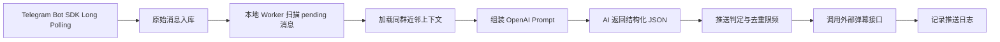

# Telegram 弹幕 MVP 设计方案

## 1. 当前结论

本期弹幕生成链路不做翻译，不做复杂话题表，也不做多语言镜像分发。

每条 TG 文本消息只生成一次弹幕，弹幕语言直接使用该 TG 群的原始语言。AI 负责广告识别、币对识别、上下文理解、话题字段提炼和最终弹幕文案生成。

Telegram 抓取入口使用 Java SDK Long Polling 模式，不使用 webhook。服务主动向 Telegram 拉取 update，不需要暴露公网回调地址，也不需要内网穿透。

## 2. 主流程



## 2.1 Telegram SDK Polling 配置

启动时通过环境变量配置 Bot Token：

```bash
export TELEGRAM_BOT_TOKEN="你的_BOT_TOKEN"
```

当前默认配置：

- `danmaku.telegram.polling.enabled=true`

如果这个 bot 之前配置过 webhook，需要先在 Telegram 侧删除 webhook，否则 `getUpdates` 可能收不到消息。

## 3. AI 输出

AI 返回一个 JSON 对象，字段包括：

- `decision`：`push`、`discard`、`hold`
- `decisionReason`：判定原因
- `ad` / `adReason`：是否广告及原因
- `displayable`：是否适合展示
- `symbol`：关联交易对，例如 `BTCUSDT`
- `eventType`：事件类型
- `sentiment`：情绪倾向
- `topic`：分享使用的话题关键词，只是一个短字段
- `confidence`：置信度
- `sourceLanguage`：原始群语言
- `content`：最终弹幕正文

## 4. 不做翻译

弹幕生成阶段不再做以下事情：

- 不把英文社群内容翻译到德语、印地语、波斯语、罗马尼亚语、荷兰语、波兰语页面
- 不生成多个 `targetLanguage` 投递目标
- 不为了镜像语言再次调用 AI
- 不维护 `TranslationDispatchService`

外部弹幕接口收到的是单条消息对应的一条弹幕：

- `symbol`
- `language`
- `content`
- `topic`
- `eventType`
- `sentiment`
- `confidence`

## 5. 话题设计

当前 `topic` 只用于分享展示，不做独立话题聚合表。

AI 可以结合上下文提炼一个短话题，例如：

- `BTC突破讨论`
- `ETH手续费争议`
- `SOL生态热度`

该字段会写入推送判定日志、弹幕推送日志，并传给外部弹幕服务。
